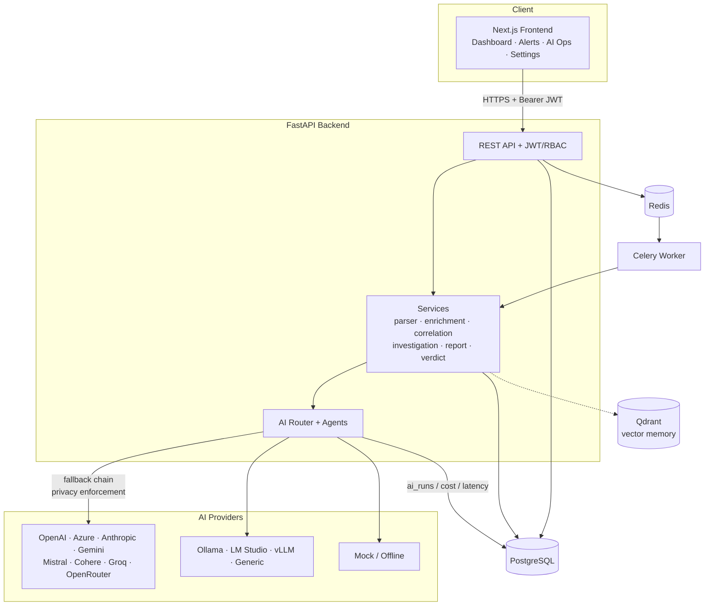

# 🛡️ AutoSOC Command Center

> **AI-powered SOC automation for alert triage, investigation, enrichment, reporting, and safe response guidance.**


AutoSOC Command Center is a **local-first, enterprise-grade SOC automation platform**. It ingests raw security alerts, normalizes them, extracts and enriches IOCs, correlates with prior cases and customer context, runs a **multi-agent AI investigation**, and produces professional SOC reports — while keeping every high-risk response action **human-approved**.

It runs **fully offline** with a built-in mock AI provider (zero API keys), and supports **13 AI providers** including local LLMs (Ollama, LM Studio, vLLM) for private deployments.

---

## ✨ Features

- **Alert intake** — paste text/JSON, JSON API, webhook, CSV/email (scaffold).
- **Parser & normalizer** — CrowdStrike, Splunk, Wazuh, Elastic, Suricata, WAF/F5, Sentinel.
- **Entity & IOC extraction** — IPs, hashes, domains, URLs, users, hosts, processes, command lines.
- **IOC enrichment** — deterministic mock + VirusTotal/AbuseIPDB/OTX/GreyNoise/Shodan/GeoIP/WHOIS scaffolds.
- **Case correlation** — same IP/user/host/alert-name, prior verdicts, analyst feedback.
- **Customer context** — allowlists, known false positives, assets, service accounts, SOPs.
- **Multi-agent AI** — intake, IOC, context, MITRE, investigation, report, detection-engineer, QA, privacy-guard, cost-optimizer agents.
- **Evidence-based verdicts** — every verdict shows evidence + missing evidence; weak evidence → *Needs Review*.
- **MITRE ATT&CK mapping** with confidence and rationale.
- **Detection engineering** — Splunk SPL, CrowdStrike LogScale, Wazuh, Elastic KQL, Sigma, Sentinel KQL.
- **Reports** — markdown investigation report, customer email draft, ticket note, daily SOC summary.
- **AI observability** — provider health, token usage, cost, latency, fallback count, local vs cloud split.
- **Multi-tenant MSSP mode** — orgs → customers, per-customer AI policy, data isolation.
- **Security guardrails** — recommendation-only response, audit logging, PII redaction, local-only mode.

---

## 🏗️ Architecture



The **AI Router** chooses a provider per routing mode (auto/cost/quality/privacy/speed/soc_critical/offline), enforces per-customer privacy policy, redacts PII before any external call, and falls back down a configurable chain — always ending at the mock provider so the system never hard-fails.

See [`docs/architecture.md`](docs/architecture.md) for the full multi-agent pipeline.

---

## 🤖 AI Provider Support

| Provider | Type | Status | Env keys |
|---|---|---|---|
| OpenAI | cloud | ✅ implemented | `OPENAI_API_KEY` |
| Azure OpenAI | cloud | ✅ implemented | `AZURE_OPENAI_*` |
| Anthropic Claude | cloud | ✅ implemented | `ANTHROPIC_API_KEY` |
| Google Gemini | cloud | ✅ implemented | `GEMINI_API_KEY` |
| Mistral | cloud | ✅ implemented | `MISTRAL_API_KEY` |
| Cohere | cloud | ✅ implemented | `COHERE_API_KEY` |
| Groq | cloud | ✅ implemented | `GROQ_API_KEY` |
| OpenRouter | cloud | ✅ implemented | `OPENROUTER_API_KEY` |
| Generic OpenAI-compatible | cloud/self | ✅ implemented | `GENERIC_OPENAI_*` |
| Ollama | local | ✅ implemented | `OLLAMA_BASE_URL` |
| LM Studio | local | ✅ implemented | `LMSTUDIO_BASE_URL` |
| vLLM | local | ✅ implemented | `VLLM_BASE_URL` |
| Mock | offline | ✅ default | — |

Switch provider in the UI (**Settings → Providers**, or the provider selector on the Alert Detail pipeline bar) or via `DEFAULT_AI_PROVIDER` / `AI_FALLBACK_CHAIN` in `.env`. See [`docs/ai-providers.md`](docs/ai-providers.md).

### 🔒 Local / Private LLM support

Run **100% offline** with no data leaving your environment:

```bash
ollama pull llama3.1
# .env:
DEFAULT_AI_PROVIDER=ollama
OLLAMA_MODEL=llama3.1
```

Per-customer **local-only mode** forces all AI to local providers. See [`docs/local-llm-setup.md`](docs/local-llm-setup.md).

---

## 📸 Screenshots

> _Placeholder — add screenshots of the Dashboard, Alert Detail (AI Investigation tab), AI Operations, and Settings pages here._

| Dashboard | Alert Investigation | AI Operations |
|---|---|---|
| `docs/img/dashboard.png` | `docs/img/investigation.png` | `docs/img/ai-ops.png` |

---

## 🚀 Quick start

```bash
git clone <your-fork> autosoc-command-center
cd autosoc-command-center
cp .env.example .env          # works out of the box with the mock provider
make up                       # builds & starts the full stack
# backend seeds 20 demo alerts automatically on first boot
```

- Frontend → http://localhost:3000
- Backend API docs → http://localhost:8000/docs
- Health → http://localhost:8000/health

**Run with local LLM (Ollama):**
```bash
make up-local-llm
docker exec -it autosoc-command-center-ollama-1 ollama pull llama3.1
```

**Run the backend locally without Docker (SQLite):**
```bash
cd backend
python -m venv .venv && . .venv/bin/activate
pip install -r requirements.txt
DATABASE_URL="sqlite+pysqlite:///./autosoc.db" python -m app.db.seed
DATABASE_URL="sqlite+pysqlite:///./autosoc.db" uvicorn app.main:app --reload
```

---

## 🐳 Docker Compose services

| Service | Port | Purpose |
|---|---|---|
| `frontend` | 3000 | Next.js UI |
| `backend` | 8000 | FastAPI API (auto-seeds on boot) |
| `postgres` | 5432 | Primary database |
| `redis` | 6379 | Celery broker/result backend |
| `celery-worker` | — | Async pipeline processing |
| `qdrant` | 6333 | Vector memory (optional backend) |
| `ollama` | 11434 | Local LLM (via `docker-compose.local-llm.yml`) |

`make` targets: `up`, `up-local-llm`, `down`, `logs`, `ps`, `seed`, `migrate`, `test`, `backend`, `frontend`, `clean`.

---

## ⚙️ Key environment variables

| Variable | Default | Description |
|---|---|---|
| `DEFAULT_AI_PROVIDER` | `mock` | Primary AI provider |
| `DEFAULT_AI_MODEL` | `mock-soc-1` | Default model |
| `AI_FALLBACK_CHAIN` | `mock` | Comma-separated fallback order |
| `AI_ROUTING_MODE` | `auto` | `auto/cost/quality/privacy/speed/soc_critical/offline` |
| `AI_ENABLE_PII_REDACTION` | `true` | Redact PII before external AI |
| `DATABASE_URL` | postgres | DB connection (sqlite supported) |
| `JWT_SECRET` | _change me_ | JWT signing secret |
| `SEED_ADMIN_EMAIL` / `SEED_ADMIN_PASSWORD` | `admin@autosoc.local` / `Admin123!` | Seed admin |

Full list in [`.env.example`](.env.example).

---

## 🔑 Demo credentials

```
Email:    admin@autosoc.local
Password: Admin123!
```

---

## 🎬 Demo workflow

1. Log in with the demo credentials.
2. **Dashboard** — 20 seeded alerts across customers *Globex* and *Initech*.
3. Open **Alerts → "C2 Domain Communication Detected"**.
4. Run the pipeline bar: **Parse → Enrich → Correlate → Investigate → Generate Report**.
5. Review the **AI Investigation** tab — verdict *True Positive* with evidence, MITRE mapping, and detection queries (driven by the malicious `beacon.evil-c2.example` IOC).
6. Open the **Report** tab for the full markdown SOC report + customer email draft + ticket note.
7. Visit **AI Operations** to see token usage, latency, cost, and local-vs-cloud split.
8. In **Settings**, switch `DEFAULT_AI_PROVIDER` to `ollama` and re-investigate to run privately.

Full script in [`docs/demo-flow.md`](docs/demo-flow.md).

### Sample alert

```json
{
  "alert_name": "C2 Beacon to Known Bad Domain",
  "source_tool": "Suricata",
  "severity": "Critical",
  "src_ip": "10.20.8.55",
  "dest_ip": "203.0.113.66",
  "domain": "beacon.evil-c2.example",
  "detail": "Periodic beaconing to known command-and-control domain"
}
```

20 more in [`examples/sample-alerts/`](examples/sample-alerts/).

---

## 🔐 Security disclaimer

AutoSOC is a **defensive** security tool. It does **not** perform offensive exploitation, malware generation, or destructive automation. All response/containment actions are **recommendations only** and are flagged `requires_human_approval`. Tenant data is isolated per organization, API keys are never exposed to the frontend, secrets are redacted from logs, and customers can enforce **local-only AI** so data never leaves their environment. See [`docs/security.md`](docs/security.md).

---

## 🗺️ Roadmap

- [ ] Streaming AI responses in the UI
- [ ] Live VirusTotal/AbuseIPDB/GreyNoise enrichment (keys → real lookups)
- [ ] Qdrant-backed vector memory for case/SOP retrieval (RAG)
- [ ] SIEM/EDR webhook ingestion connectors (Splunk HEC, CrowdStrike streaming)
- [ ] Approval workflow UI for response recommendations
- [ ] SSO/SAML, fine-grained RBAC, per-customer dashboards
- [ ] Sigma → live deployment export

---

## 💰 Monetization idea

SaaS tiers (Analyst / Team / MSSP) priced per analyst seat + alert volume, with a **local-first / air-gapped** self-hosted tier for regulated industries that mandates local LLMs. The MSSP multi-tenant model and per-customer AI policy are the differentiators. See [`docs/monetization.md`](docs/monetization.md).

---

## 📚 Documentation

[Architecture](docs/architecture.md) · [AI Providers](docs/ai-providers.md) · [Local LLM Setup](docs/local-llm-setup.md) · [API](docs/api.md) · [Security](docs/security.md) · [Deployment](docs/deployment.md) · [Demo Flow](docs/demo-flow.md) · [Monetization](docs/monetization.md)

---

_Built as a portfolio-grade demonstration of AI-integrated SOC automation. Use safe, fake IOCs only — all sample data uses reserved/documentation ranges._
