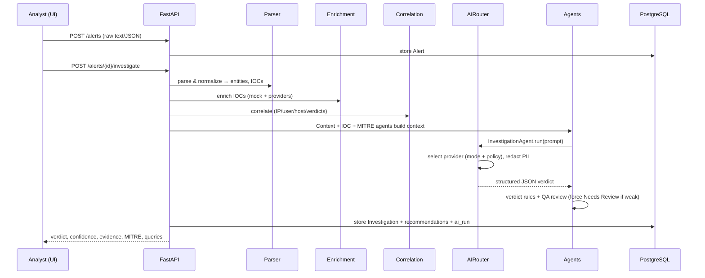
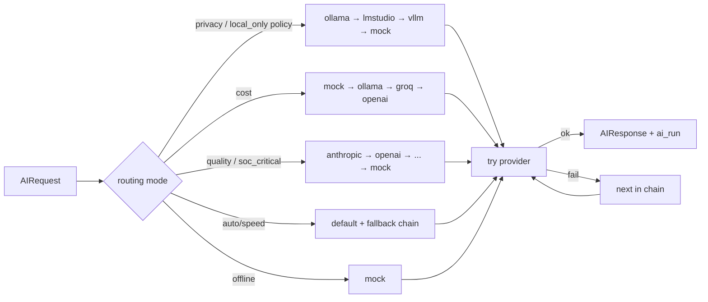

# Architecture

AutoSOC Command Center is a local-first, multi-tenant SOC automation platform built around a provider-agnostic AI layer and an evidence-based investigation pipeline.

## Components

| Layer | Tech | Responsibility |
|---|---|---|
| Frontend | Next.js 14, TypeScript, Tailwind, TanStack Query, Recharts | SOC console: dashboard, alerts, investigations, reports, AI ops, settings |
| API | FastAPI, Pydantic, JWT, RBAC | REST endpoints, auth, tenant scoping |
| Services | SQLAlchemy | parser, enrichment, correlation, investigation, report, verdict, audit |
| AI | Provider abstraction + AIRouter + agents | provider selection, fallback, privacy, observability |
| Data | PostgreSQL | alerts, investigations, reports, ai_runs, audit, tenancy |
| Queue | Redis + Celery | async pipeline processing |
| Vector memory | Qdrant / pgvector (pluggable) | case/SOP/feedback retrieval (RAG-ready) |

## Request → investigation data flow

## Multi-agent AI pipeline

Agents are single-responsibility services sharing one `AIRouter` (so observability, fallback, and privacy enforcement happen in one place).

| Agent | Role | Offline-capable |
|---|---|---|
| **Alert Intake** | parse raw alert, detect category | ✅ (deterministic + optional AI) |
| **IOC Enrichment** | merge enrichment results into IOC summary | ✅ |
| **Context Retrieval** | pull allowlists, known FPs, SOPs, prior cases | ✅ |
| **Threat Intel / MITRE** | baseline ATT&CK mapping | ✅ |
| **Investigation** | verdict, confidence, evidence, missing evidence | ✅ (mock or LLM) |
| **Report Writer** | render professional markdown report | ✅ (deterministic) |
| **Detection Engineer** | Splunk/LogScale/Wazuh/Elastic/Sigma/Sentinel queries | ✅ |
| **QA Review** | flag weak claims, force Needs Review | ✅ |
| **Cost Optimizer** | pick provider tier by severity/mode | ✅ |
| **Privacy Guard** | enforce local-only, redact PII before external AI | ✅ |

## AI Router

Key guarantees:
- The chain **always ends at `mock`**, so the system never hard-fails.
- External calls are skipped entirely when a customer policy sets `local_only_mode` or `external_ai_allowed=false`.
- PII is redacted before any external provider call when `redact_pii_before_ai` is set.
- Every attempt (success or failure) is recorded in `ai_runs` for cost/latency/usage observability.

## Database schema (overview)

- **Identity/tenancy:** `organizations`, `users`, `roles`, `user_roles`, `customers`, `customer_ai_policies`
- **Alerts:** `alerts`, `normalized_alerts`, `entities`, `iocs`, `enrichment_results`, `cases`
- **Investigation:** `investigations`, `ai_verdicts`, `reports`, `email_drafts`, `ticket_notes`, `feedback`, `response_recommendations`, `approval_requests`
- **AI:** `ai_runs`, `ai_provider_configs`, `ai_prompt_templates`
- **Context:** `customer_allowlists`, `assets`, `service_accounts`, `known_false_positives`, `knowledge_documents`, `vector_memory_metadata`
- **Platform:** `playbooks`, `integrations`, `audit_logs`

Every tenant-scoped table carries `organization_id` (and `customer_id` where relevant); repositories/services filter by the authenticated user's organization to enforce isolation.

## Vector memory

`vector_memory_metadata` + `knowledge_documents` model the RAG layer for past-case memory, customer SOPs, allowlist context, analyst-feedback retrieval, and report examples. The `VECTOR_BACKEND` setting selects `memory` (default, in-process), `qdrant`, or `pgvector`. The Context Retrieval agent currently uses relational lookups; swapping in semantic search is a drop-in enhancement.
